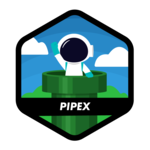

# Hello, I'm Andy a 42 student 👋

 

  
 <h2>Finished Projects: </h2> 

    <li> 1st Circle :
      
      
      
        
    <li>2nd Circle : 
      
       
        
      <!--- <li>3rd Circle :  -->

  
 <h2>Ongoing Projects: </h2>

    <li> Project(s) :
      

---
- I'm learning C through my school, but I'm also studying React Native in my spare time for my side projects 💻
- I want to create a mobile app that combines gaming and sports 📱
- Feel free to contact me if you'd like to discuss this further 💬
---

# Operating Systems :

    
  
  
  

# Languages:

 
  
  
  

# Tools:

  
  
  

